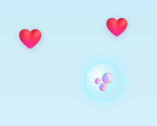

1. when i launch the game in brower, still no music play. start game has music, but when the game ends and restart from home screen, there is no music again.
2. the Treasure Bubbles should be clearly shown in screen. see screenshots below, it is hard to notice.
3. 
4. after clicking treasure bubble, its Collectibles should spawn around the clicking area, I mean increase quantity and make it more clear for kid to collect. 