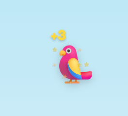
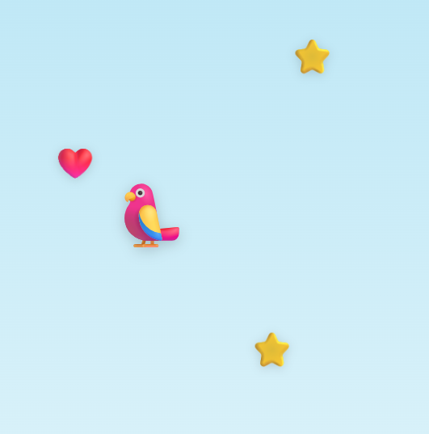
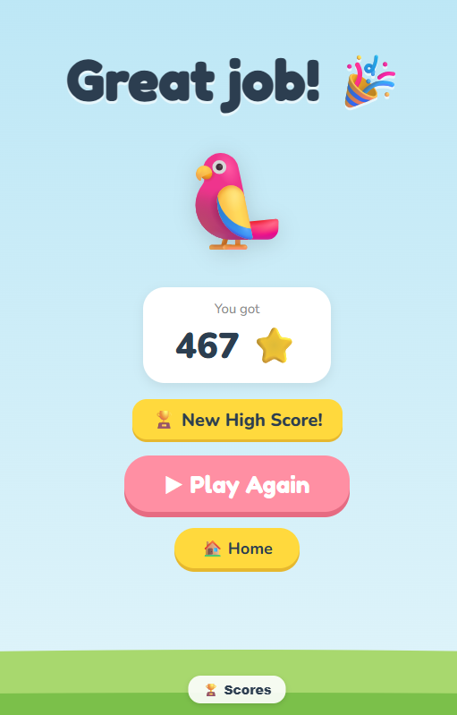
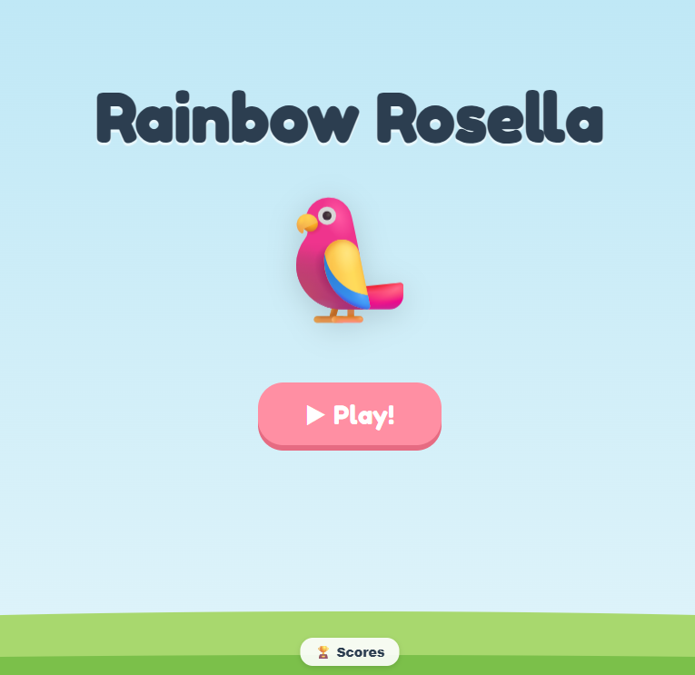

1. the score pop for gold star, currently not obvious enough on the backgroud, will adding a very thin frame on the contour, or tweaking the color help?
2. 
3. make the rosella slightly bigger in game play.
4. 
5. move the button to leaderboard a bit larger and move up a bit on both game start and game result screen, but still complete on the grass.
6. 
7. 